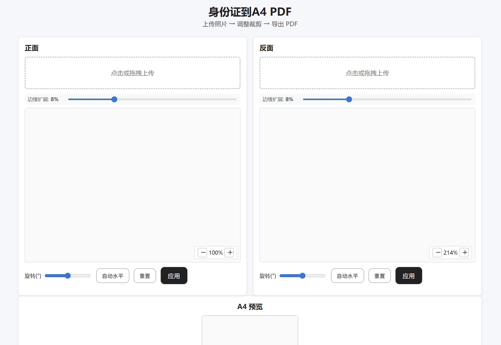

# 身份证图片合并到 A4 PDF

<div align="center">



**一个简单易用的身份证到 PDF 转换工具**

[功能特性](#功能概述) • [快速开始](#快速开始) • [部署体验](#docker-部署)

</div>

## 功能概述

✨ **核心功能**
- 📷 自动检测身份证区域并进行透视矫正
- 📐 智能裁切：自动边缘扩展（默认 8%），确保四个角完整显示
- 👁️ 实时预览：调整时自动预览裁切效果，所见即所得
- 📏 标准化输出：强制调整为身份证标准比例（1.585:1），导出真实尺寸（85.6×54.0 mm）PDF

🛠️ **辅助工具**
- 🔧 边缘扩展：可调整 0%-30%，确保完整显示
- 🎯 自动水平矫正：一键校正倾斜角度
- 🔄 旋转微调：手动调整旋转角度（-45° 到 45°）
- 🔙 重置检测：快速恢复到自动检测状态

🎨 **水印功能**
- ✍️ 自定义文字：默认"仅用于XX办理"，可自由修改
- 🎨 样式调整：大小（12-120pt）、颜色、透明度（5%-100%）
- 📐 旋转角度：-90° 到 90° 可调
- 🖼️ 两种模式：单个水印（居中）和满屏水印（平铺）
- ⚡ 快速预设：办理银行卡、社保、护照等常用用途

📱 **移动端优化**
- 👆 触摸判定半径 30px，更容易操作
- 🔍 双指捏合缩放支持
- 📸 摄像头直接拍照上传

---

## 🔒 隐私与数据处理

- ✅ **不保存数据**：所有图片处理在内存中完成，不写入磁盘
- ✅ **立即释放**：前端临时图片 URL 读取后立即释放
- ✅ **透明开源**：代码完全开源，可自行部署验证

---

## 🚀 快速开始

### 安装依赖

```bash
pip install -r requirements.txt
```

### 三种使用方式

#### 1️⃣ 桌面 GUI
```bash
python idcard2pdf.py
```

#### 2️⃣ 命令行
```bash
python idcard2pdf.py --front <正面图片> --back <反面图片> --out <输出.pdf>
```

#### 3️⃣ 网页版（推荐）
```bash
python webserver.py
# 浏览器访问 http://127.0.0.1:5000/
```

---

## 📖 使用说明（网页版）

### 基本流程

1. **上传图片** - 上传正反面图片（支持拖拽或点击）
2. **自动裁切** - 系统自动检测并裁切身份证区域，实时预览效果
3. **调整参数** - 根据需要调整裁切区域和水印设置
4. **导出 PDF** - 点击"导出 PDF"按钮下载

### 裁切调整工具

| 工具 | 说明 |
|------|------|
| **边缘扩展** | 默认 8% 扩展，确保四个角完整显示（可调整 0%-30%） |
| **拖动角点** | 精确调整选区位置（移动端触摸区域已优化） |
| **自动水平** | 一键矫正倾斜角度 |
| **旋转微调** | 手动调整旋转角度（-45° 到 45°） |
| **重置** | 恢复到自动检测状态 |

### 水印设置（可选）

| 参数 | 范围 | 默认值 |
|------|------|--------|
| **水印文字** | 自定义 | "仅用于XX办理" |
| **字体大小** | 12-120pt | 48pt |
| **透明度** | 5%-100% | 30% |
| **颜色** | 任意颜色 | 红色 |
| **旋转角度** | -90° 到 90° | -45° |
| **水印模式** | 单个/满屏 | 满屏（平铺） |

> 💡 **提示**：点击"常用用途"按钮快速选择预设文字（办理银行卡、社保、护照等）

### 实时预览

- ✅ 所有调整立即反映在 A4 预览中
- ✅ 水印效果实时显示
- ✅ 所见即所得，确保满意后再导出

---

## 📋 关键参数

### `extract_idcard(path, pad_px=20, refine=True, rotate_to_landscape=True)`

| 参数 | 说明 |
|------|------|
| `pad_px` | 透视后的四周留白像素，避免边缘裁剪 |
| `refine` | 抠图精炼；若为 True，保持证件内部不透明 |
| `rotate_to_landscape` | 自动横向摆放（已统一旋转方向） |

---

## 🔧 技术要点

- **检测**：边缘 → 轮廓四点 → 几何筛选长宽比，提取身份证四边形
- **透视**：按 `tl,tr,br,bl` 点顺序计算单应矩阵并矫正
- **抠图**：可选基于掩码的前景保留，避免证件内部文字被抠掉
- **A4 排版**：以毫米为单位换算到 PDF 点，真实尺寸绘制

---

## 📦 Docker 部署

### 构建镜像

```bash
docker build -t idcard2pdf .
```

### 运行容器

```bash
docker run -p 8000:5000 -e PORT=5000 idcard2pdf
```

### 访问应用

打开 `http://localhost:8000/`

---

## ☁️ Render 部署

1. 推送代码到仓库（GitHub/GitLab）
2. Render → New → Web Service → 选择你的仓库
3. 构建方式选"Use Dockerfile"
4. 环境变量：`PORT=5000`（平台通常自动注入），可选 `WEB_CONCURRENCY=2`
5. 构建完成后，使用 Render 提供的 URL 访问网页端

---

## ⚠️ 注意事项

- 复杂背景下建议在网页端手动微调四角与角度
- 上传大小默认限制 20MB（`webserver.py` 可调整）
- 导出 PDF 尺寸为真实身份证大小在 A4 中的居中排版

---

## 📝 版本记录

### v0.4
- **新增水印功能**：
  - 支持自定义水印文字、大小（12-120pt）、颜色、透明度（5%-100%）
  - 两种水印模式：单个水印（居中显示）和满屏水印（平铺模式）
  - 水印旋转角度可调（-90° 到 90°）
  - 常用用途预设按钮（办理银行卡、社保、护照等）
  - **所见即所得**：A4 预览实时显示水印效果
  - **中文字体支持**：自动注册系统中文字体，解决中文水印显示问题
  - **跨平台兼容**：支持 Windows、Linux、macOS 系统字体

### v0.3
- **核心改进**：修复图片尺寸异常，强制输出标准化宽高比（1.585:1）
- **交互优化**：添加实时预览功能（600ms 防抖），大幅减少操作步骤
- **移动端优化**：触摸判定半径增加到 30px，角点视觉半径增加到 12px
- **辅助功能**：
  - 自动水平矫正：基于上下边平均角度，一键校正倾斜
  - 边缘扩展控制：默认 8% 扩展，确保身份证四个角完整显示（可调整 0%-30%）
  - 重置按钮：快速恢复到自动检测状态
- **提示优化**：自动检测失败时显示警告信息，引导用户手动调整

### v0.2
- 页面底部增加"图片不会保存，处理后删除"提示与 GitHub 链接
- 应用裁剪后自动横向，并统一旋转方向
- 前端释放临时图片 URL，进一步减少资源占用

### v0.1
- 初始版本

---

## 📄 许可证

本项目采用 MIT 许可证 - 详见 [LICENSE](LICENSE) 文件

---

## 🤝 贡献

欢迎提交 Issue 和 Pull Request！

---

<div align="center">

**如果觉得有用，请给个 ⭐ Star 支持一下**

</div>
